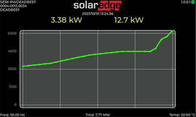
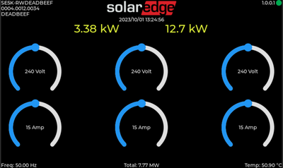
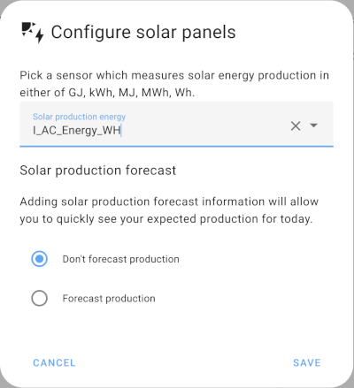

# SolarEdge MQTT Gateway

### Description

The software retrieves data from a SolarEdge inverter using tcp-modbus and publishes it over mqtt, while drawing charts and updating gauges.





All (modbus) parameters are retrieved in a single call, to reduce network overhead and code complexity.
Once processed, the data converted and published to the configured mqtt broker as a json document:


```json
{
  "esp_uptime":   772903,
  "C_Manufacturer":       "SolarEdge ",
  "C_Model":      "SE5K-RW0TEBEN4",
  "C_Version":    "0004.0017.0046",
  "C_SerialNumber":       "DEADBEEF",
  "C_SunSpec_Phase":      103,
  "I_AC_Current": 7.78000020980835,
  "I_AC_CurrentA":        2.6099998950958252,
  "I_AC_CurrentB":        2.5699999332427979,
  "I_AC_CurrentC":        2.5999999046325684,
  "I_AC_VoltageAB":       399.39999389648438,
  "I_AC_VoltageBC":       400.89999389648438,
  "I_AC_VoltageCA":       399.70001220703125,
  "I_AC_VoltageAN":       230.69999694824219,
  "I_AC_VoltageBN":       230.80000305175781,
  "I_AC_VoltageCN":       231.39999389648438,
  "I_AC_Power":   1787.0999755859375,
  "I_AC_Frequency":       49.959999084472656,
  "I_AC_VA":      1798.199951171875,
  "I_AC_VAR":     -199.67999267578125,
  "I_AC_PF":      -99.379997253417969,
  "I_AC_Energy_WH":       5691921,
  "I_AC_Energy_WH_24H":   12310,
  "I_DC_Current": 2.4189999103546143,
  "I_DC_Voltage": 750,
  "I_DC_Power":   1814.300048828125,
  "I_Temp_Sink":  47.3499984741211,
  "I_Status":     4,
  "I_Status_Vendor":      0
}
```

*See sunspec.h or sunspec.txt for information about the items above*

Additional messages are published on the broker (internal temperature and **Lifetime Energy production**) to make integration with homeassistant easy.

```json
    i_ac_energy_wh/state 5691921
    i_temp_sink/state 47
```



### Configuration

Using a serial connection over USB, you can configure the settings for wifi, mqtt and the address of the inverter:


Available commands:

* ```help``` - List of available commands
* ```reset``` - clear the internal configuration
* ```reboot``` - call esp_restart() to reboot the esp hardware and activate new configuration
* ```info``` - show the current configuration
* ```save``` - write the configuration to nvs, should be done after wifi/mqtt/modbus commands
* ```wifi``` - configure wifi parameters
* ```mqtt``` - configure mqtt parameters
* ```modbus``` - configure modbus parameters

```
wifi -s <ssid> -p <password> [-u wpa2-username] [-i wpa2-identity]
mqtt -m <mqtt-uri> [-u mqtt-user] [-p mqtt-password] [-t topic] [-f publish-frequency] [-h topic-for-homeassistant]
modbus -i <inverter-ip-address> [-p modus-port-number]
```

For example:

```
      cfg> wifi -s HomeNetwork -p ZaQxSw321
      cfg> mqtt -m mqtt://192.168.10.40:1883
      cfg> modbus -i 192.168.40.1 -p 1502
      cfg> save
      Configuration saved. Reboot to activate
      cfg> reboot
```


### Build targets

Two targets are available: ESP32 and ESP32S3


* ESP32:

  Headless esp32 with just mqtt and modbus. Missing all the fancy lvgl graphics.

      idf.py set-target esp32
      idf.py build flash monitor


* ESP32S3:

  Uses a [Sunton ESP32-S3 800x480 Capacitive touch display](https://nl.aliexpress.com/item/1005004788147691.html) to also display semi-realtime stats.

      idf.py set-target esp32s3
      idf.py build flash monitor

  * [Display case and stand](https://www.printables.com/model/350540-sunton-esp32s3-8048s043c-43-screen-case/files) STL files.
  * Uses LVGL, esp_lcd_panel_rgb and esp_lcd_touch_gt911 from the Espressif component registry.


### Notes:


* All data is volatile, the measurements for the 24 hour cycle are reset at midnight.
* In the current state, only a single inverter (SE5K-RW0TEBEN4) is tested, with modbus device-id set to 1.
* Graphs are for a 3-fase setup, using a single-fase inverter will result in multiple items without data.
* Time is synchronised using NTP with pool.ntp.org and dhcp-option 42 if available.
* TODO: make the timezone configurable/selectable. Now hardcoded to Europe/Amsterdam.
* TODO: add ssl support for mqtt?
* The inverter only supports a single tcp client. When your esp is reset, due to configuration changes or other, it might take a couple of minutes before the inverter will accept a new connection:

      I (99033) modbus: Connecting to 192.168.40.25 on 1502
      I (99033) modbus: connect() error
      I (99043) TaskModbus: Retry connection..
      I (101543) modbus: Connecting to 192.168.40.25 on 1502
      I (101543) TaskModbus: Connected


<sup>SolarEdge is a registered trademark. No affiliation with SolarEdge, all bugs should be reported here. Pull requests are welcome</sup>
